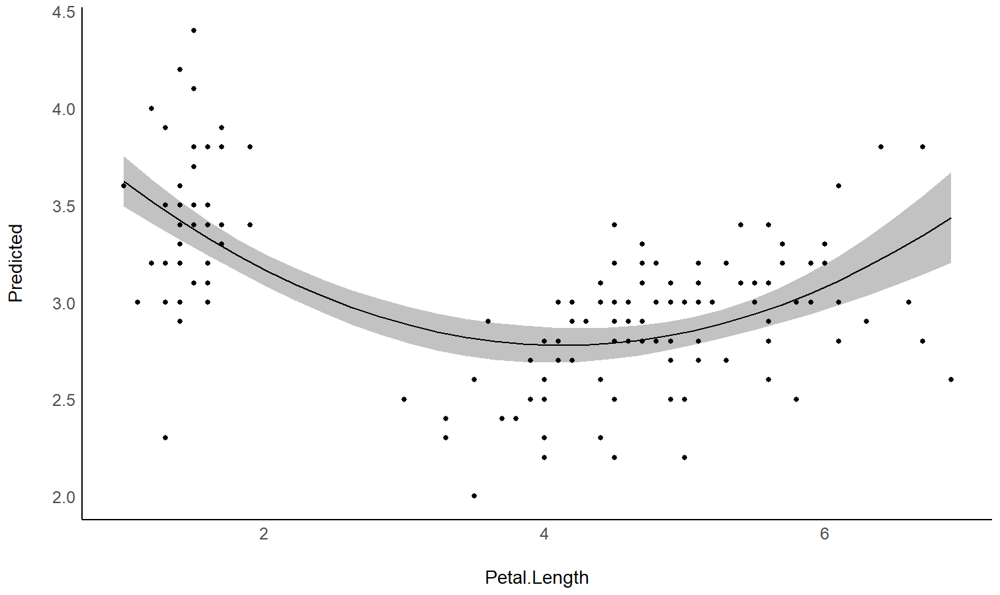

# modelbased 

[](https://cran.r-project.org/package=modelbased)
[](https://cran.r-project.org/package=modelbased)
[](https://travis-ci.org/easystats/modelbased)
[](https://codecov.io/gh/easystats/modelbased)

`modelbased` is a lightweight package helping with model-based
estimations, used in the computation of marginal means, contrast
analysis and predictions.

## Installation

Run the following:

``` r
install.packages("devtools")
devtools::install_github("easystats/modelbased")
```

``` r
library("modelbased")
```

## Documentation

[](https://easystats.github.io/modelbased/)
[](https://easystats.github.io/blog/posts/)
[](https://easystats.github.io/modelbased/reference/index.html)

Click on the buttons above to access the package
[**documentation**](https://easystats.github.io/modelbased/) and the
[**easystats blog**](https://easystats.github.io/blog/posts/), and
check-out these vignettes:

  - [**Visualisation
    matrix**](https://easystats.github.io/modelbased/articles/visualisation_matrix.html)
  - [**Marginal
    means**](https://easystats.github.io/modelbased/articles/estimate_means.html)
  - [**Contrast
    analysis**](https://easystats.github.io/modelbased/articles/estimate_contrasts.html)
  - [**Use a model to make
    predictions**](https://easystats.github.io/modelbased/articles/estimate_response.html)
  - [**Describe non-linear
    curves**](https://easystats.github.io/modelbased/articles/estimate_smooth.html)

# Features

The package is built around 5 main functions:

  - [`estimate_means()`](https://easystats.github.io/modelbased/reference/estimate_means.html):
    Estimates the average values at each factor levels
  - [`estimate_contrasts()`](https://easystats.github.io/modelbased/reference/estimate_contrasts.html):
    Estimates and tests contrasts between different factor levels
  - [`estimate_slopes()`](https://easystats.github.io/modelbased/reference/estimate_slopes.html):
    Estimates the slopes of numeric predictors at different factor
    levels
  - [`estimate_response()`](https://easystats.github.io/modelbased/reference/estimate_response.html):
    Predict the response variable using the model
  - [`estimate_smooth()`](https://easystats.github.io/modelbased/reference/estimate_smooth.html):
    Describes a non-linear term (*e.g.* in GAMs) by its linear parts

These functions are powered by the
[`visualisation_matrix()`](https://easystats.github.io/modelbased/reference/visualisation_matrix.html)
function, a smart tool for guessing the appropriate reference grid.

The package currently only supports `rstanarm` models, but will be
expanded to cover a large variety of frequentist and Bayesian models.

## Examples

### Create smart grids to represent complex interactions

Check-out [**this
vignette**](https://easystats.github.io/modelbased/articles/visualisation_matrix.html)
to create this plot:

<!-- -->

### Estimate marginal means

Check-out [**this
vignette**](https://easystats.github.io/modelbased/articles/estimate_means.html)
to create this plot:

<!-- -->

``` r
library(rstanarm)

model <- stan_glm(Sepal.Width ~ Species, data = iris)

estimate_means(model)
```

    ## Species    | Median |       89% CI
    ## ----------------------------------
    ## setosa     |   3.43 | [3.34, 3.50]
    ## versicolor |   2.77 | [2.70, 2.85]
    ## virginica  |   2.98 | [2.90, 3.05]

### Contrast analysis

Check-out [**this
vignette**](https://easystats.github.io/modelbased/articles/estimate_contrasts.html)
to create this plot:

<!-- -->

``` r
estimate_contrasts(model)
## Level1     |     Level2 | Median |         89% CI |     pd | % in ROPE | Median (std.)
## --------------------------------------------------------------------------------------
## setosa     | versicolor |   0.65 | [ 0.55,  0.77] |   100% |        0% |          1.50
## setosa     |  virginica |   0.45 | [ 0.34,  0.56] |   100% |        0% |          1.03
## versicolor |  virginica |  -0.21 | [-0.32, -0.10] | 99.83% |     6.93% |         -0.47
```

### Check the contrasts at different points of another linear predictor

``` r
model <- stan_glm(Sepal.Width ~ Species * Petal.Length, data = iris)

estimate_contrasts(model, modulate = "Petal.Length", length = 3)
```

    ## Level1     |     Level2 | Petal.Length | Median |        89% CI |     pd | % in ROPE | Median (std.)
    ## ----------------------------------------------------------------------------------------------------
    ## setosa     | versicolor |         1.00 |   1.52 | [ 1.05, 2.00] |   100% |        0% |          3.48
    ## setosa     |  virginica |         1.00 |   1.23 | [ 0.69, 1.76] |   100% |     0.02% |          2.82
    ## versicolor |  virginica |         1.00 |  -0.30 | [-1.03, 0.39] | 74.30% |    13.90% |         -0.68
    ## setosa     | versicolor |         3.95 |   1.79 | [ 1.04, 2.53] |   100% |        0% |          4.11
    ## setosa     |  virginica |         3.95 |   1.83 | [ 1.03, 2.60] |   100% |        0% |          4.21
    ## versicolor |  virginica |         3.95 |   0.04 | [-0.18, 0.26] | 61.40% |    51.00% |          0.09
    ## setosa     | versicolor |         6.90 |   2.08 | [ 0.50, 3.73] | 98.10% |     1.18% |          4.77
    ## setosa     |  virginica |         6.90 |   2.45 | [ 0.80, 3.95] | 99.25% |     0.42% |          5.61
    ## versicolor |  virginica |         6.90 |   0.37 | [-0.06, 0.78] | 91.25% |    11.97% |          0.85

### Find a predictor’s slopes at each factor level

``` r
estimate_slopes(model)
## Species    | Median |       89% CI |     pd | % in ROPE | Median (std.)
## -----------------------------------------------------------------------
## setosa     |   0.42 | [0.10, 0.69] | 98.85% |     4.10% |          1.70
## versicolor |   0.33 | [0.19, 0.47] | 99.95% |     0.57% |          1.32
## virginica  |   0.21 | [0.09, 0.33] | 99.83% |     6.95% |          0.87
```

### Generate predictions from your model to compare it with original data

Check-out [**this
vignette**](https://easystats.github.io/modelbased/articles/estimate_response.html)
to create this plot:

<!-- -->

``` r
estimate_response(model)
```

| Sepal.Length | Species | Median | CI\_low | CI\_high |
| -----------: | :------ | -----: | ------: | -------: |
|          5.1 | setosa  |   1.47 |    1.10 |     1.91 |
|          4.9 | setosa  |   1.44 |    1.05 |     1.85 |
|          4.7 | setosa  |   1.39 |    0.96 |     1.79 |
|          4.6 | setosa  |   1.41 |    0.99 |     1.83 |
|          5.0 | setosa  |   1.47 |    1.01 |     1.88 |
|          5.4 | setosa  |   1.52 |    1.15 |     1.95 |

### Estimate the link between the response and a predictor

See [**this
vignette**](https://easystats.github.io/modelbased/articles/estimate_response.html)
to create this plot:


``` r
model <- stan_glm(Sepal.Width ~ poly(Petal.Length, 2), data=iris)

estimate_link(model)
```

| Petal.Length | Median | CI\_low | CI\_high |
| -----------: | -----: | ------: | -------: |
|         1.00 |   3.62 |    3.51 |     3.73 |
|         1.98 |   3.18 |    3.11 |     3.24 |
|         2.97 |   2.90 |    2.82 |     2.97 |
|         3.95 |   2.78 |    2.71 |     2.86 |
|         4.93 |   2.83 |    2.77 |     2.89 |
|         5.92 |   3.05 |    2.96 |     3.14 |
|         6.90 |   3.44 |    3.25 |     3.63 |

### Describe the smooth term by its linear parts

``` r
estimate_smooth(model)
## Part | Start |  End |   Size | Trend | Linearity
## ------------------------------------------------
## 1    |  1.00 | 4.14 | 53.50% | -0.01 |      0.94
## 2    |  4.14 | 6.90 | 46.50% |  0.01 |      0.94
```
